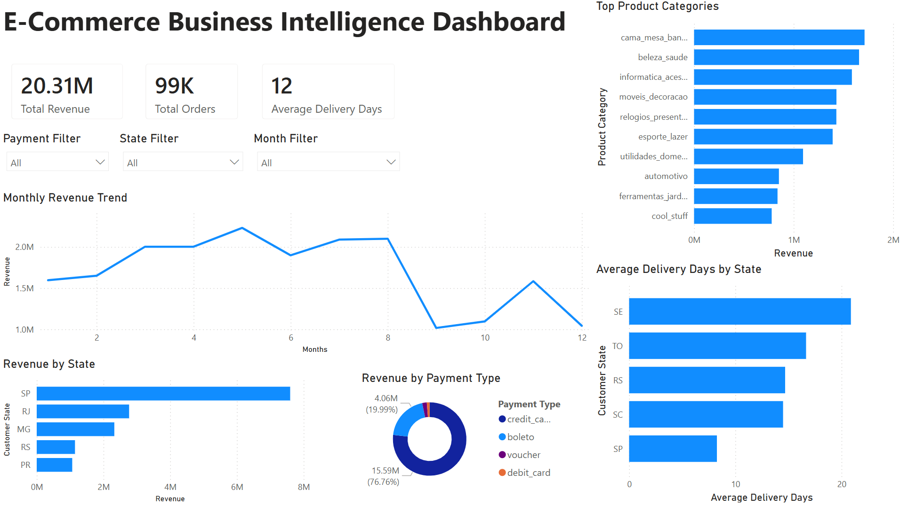

# E-Commerce Business Intelligence Analysis

End-to-end business intelligence and sales analytics project using Python, SQL, SQLite, Pandas, Matplotlib, and Power BI.

---

# Project Overview

This project analyses a large Brazilian e-commerce dataset to uncover:

- Revenue trends
- Customer purchasing behaviour
- Delivery performance
- Regional sales performance
- Payment method usage
- Product category performance

The project combines Python-based data analysis, SQL joins, and interactive Power BI dashboarding to generate actionable business insights from relational datasets.

---

# Business Questions Explored

This analysis investigates:

- Which product categories generate the most revenue?
- Which states generate the highest revenue?
- Which states experience the longest delivery times?
- Which payment methods are most commonly used?
- How does revenue change over time?
- Are revenue drops caused by genuine business trends or incomplete dataset coverage?

---

# Tools Used

- Python
- Pandas
- SQLite
- SQL
- Matplotlib
- Power BI
- VS Code
- Git & GitHub

---

# Key Analyses

## 1. Top Product Categories by Revenue
Identified the highest revenue-generating product categories.

## 2. Revenue by State
Analysed geographic revenue distribution across Brazilian states.

## 3. Delivery Performance by State
Measured average delivery times to identify potential logistics bottlenecks.

## 4. Revenue by Payment Method
Analysed customer payment preferences and purchasing behaviour.

## 5. Monthly Revenue Trends
Investigated seasonal revenue patterns and business performance over time.

## 6. Orders Per Month
Validated monthly revenue trends by analysing order volume patterns.

---

# Key Insights

- São Paulo generated the highest overall revenue
- Credit card payments overwhelmingly dominated customer purchases
- Several remote states experienced significantly longer delivery times
- Revenue and order volume dropped sharply after August, suggesting incomplete dataset coverage
- Product categories related to beauty, home goods, and gifts generated the highest revenue

---

# Interactive Power BI Dashboard

An interactive Power BI dashboard was developed to explore:

- Revenue trends
- Regional sales performance
- Delivery performance
- Product category revenue
- Payment method behaviour

The dashboard includes:
- KPI cards
- Interactive slicers
- Trend analysis
- Geographic comparisons
- Operational performance insights

---

# Example Python Visualisations

## Revenue by Payment Method

---

## Monthly Revenue Trend

---

## Top Revenue Generating States

