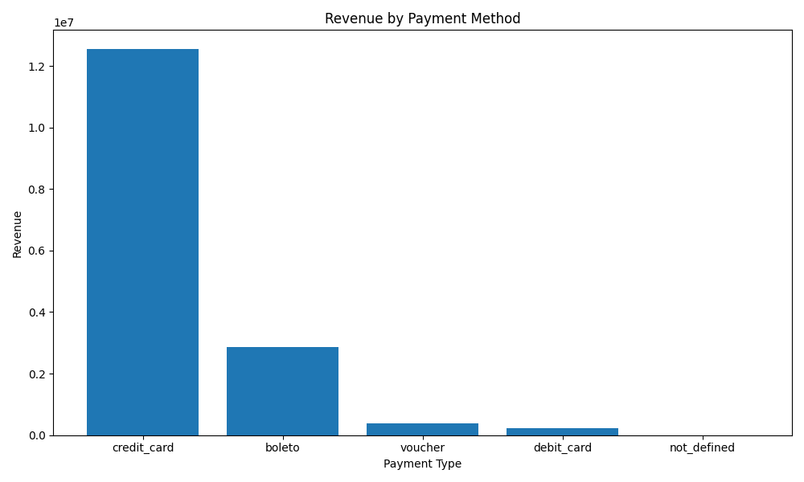
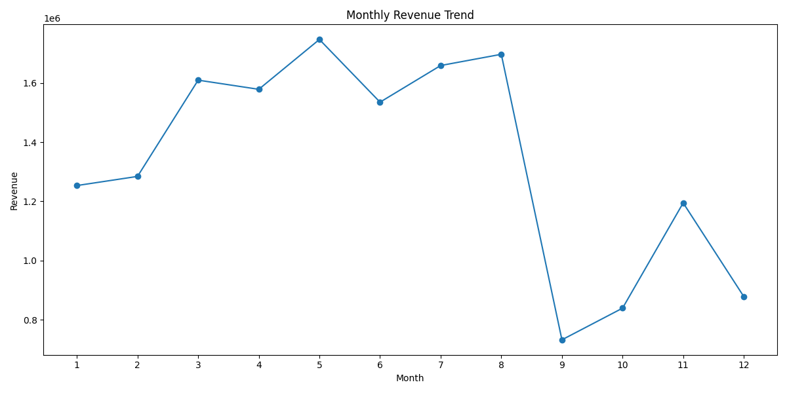
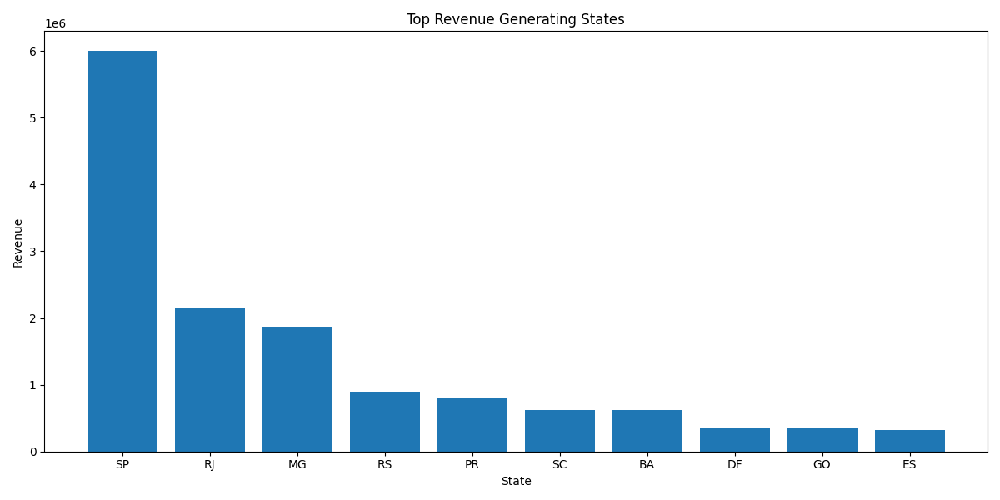

# E-Commerce Business Intelligence Analysis

Business intelligence and sales analytics project using Python, SQL, SQLite, Pandas, and Matplotlib.

---

# Project Overview

This project analyses a large Brazilian e-commerce dataset to uncover:

- Revenue trends
- Customer purchasing behaviour
- Delivery performance
- Regional sales performance
- Payment method usage
- Product category performance

The project uses SQL joins, Python data analysis, and data visualisation techniques to generate business insights from relational datasets.

---

# Business Questions Explored

This analysis investigates:

- Which product categories generate the most revenue?
- Which states generate the highest revenue?
- Which states experience the longest delivery times?
- Which payment methods are most commonly used?
- How does revenue change over time?
- Are revenue drops caused by business trends or incomplete data coverage?

---

# Tools Used

- Python
- Pandas
- SQLite
- SQL
- Matplotlib
- VS Code
- Git & GitHub

---

# Key Analyses

## 1. Top Product Categories by Revenue
Identified the highest revenue-generating product categories.

## 2. Revenue by State
Analysed geographic revenue distribution across Brazilian states.

## 3. Delivery Performance by State
Measured average delivery times to identify potential logistics bottlenecks.

## 4. Revenue by Payment Method
Analysed customer payment preferences and purchasing behaviour.

## 5. Monthly Revenue Trends
Investigated seasonal revenue patterns and business performance over time.

## 6. Orders Per Month
Validated monthly revenue trends by analysing order volume patterns.

---

# Key Insights

- São Paulo generated the highest overall revenue
- Credit card payments overwhelmingly dominated customer purchases
- Several remote states experienced significantly longer delivery times
- Revenue and order volume dropped sharply after August, suggesting incomplete dataset coverage
- Product categories related to beauty, home goods, and gifts generated the highest revenue

---

# Example Visualisations

## Revenue by Payment Method



---

## Monthly Revenue Trend



---

## Top Revenue Generating States



---

# Skills Demonstrated

- SQL joins
- Relational database analysis
- Data cleaning and transformation
- Exploratory data analysis (EDA)
- Business intelligence analysis
- Data visualisation
- Time-series analysis
- Operational analytics
- GitHub project structuring

---

# Project Structure

```plaintext
ecommerce_bi_project/
│
├── data/
├── screenshots/
├── analysis.py
├── ecommerce.db
├── requirements.txt
└── README.md
```

---

# How To Run

1. Clone the repository
2. Install dependencies:

```bash
pip install -r requirements.txt
```

3. Run the analysis script:

```bash
python analysis.py
```